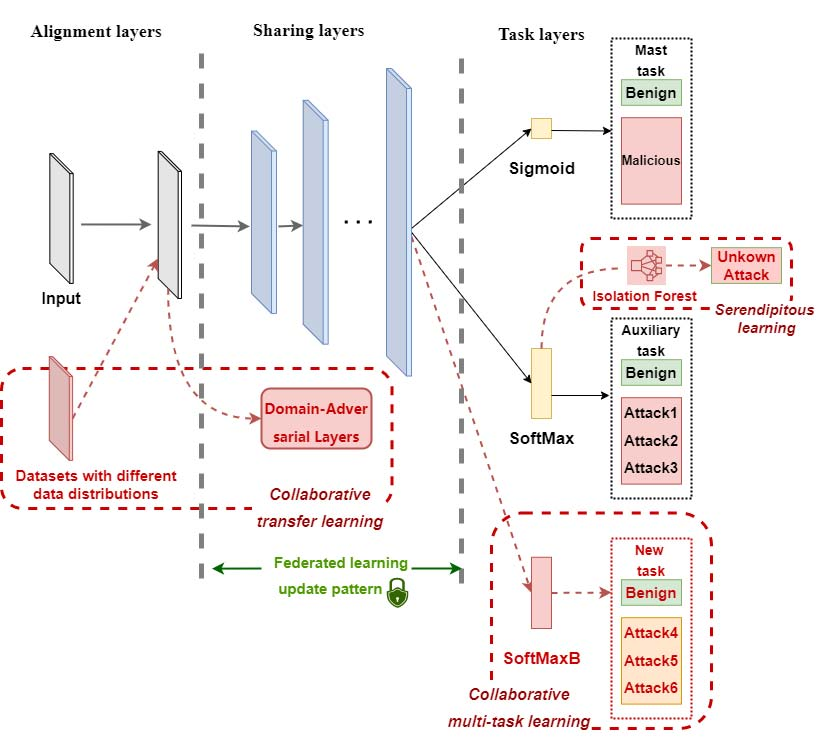

# FNEL: An Evolving Intrusion Detection System Based on Federated Never-Ending Learning
> Qin et. al.

# Notes

## Abstract
- Used NEL to ensure the model can be updated quickly
- Used Serendipitous Learning for something?
- Used Federated Learning to ensure privacy
- Steps:
    - Take new existing datasets
    - Take private datasets
    - Use federated learning to ensure privacy
    - Retrain the old model, add new attacks as a different label (Serendipitous learning/NEL)

## The Model

### Overall Structure

### Alignment Layers
- Preprocess the dataset
- 

### Sharing Layers

### Task Layers

# Action Plan
## Dataset
- CICIDS (2017/2019?)
- Get dataset
- Preprocess it
- Do some EDA
